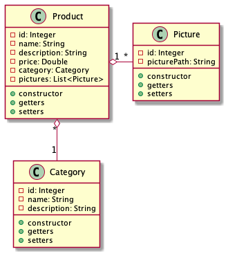

# Contextual app development

## Day 06

### Part 1:

"Blue Yu" is a new brand of mobile phones and accessories. The company wants to setup a web and mobile application to showcase and sell their products. In this regard, you are to create the required database tables.

There are several products in few categories. The categories are:

1. Smartphones
2. Wifi devices
3. Bands
4. Power banks
5. Headphones
6. VR Players
7. Charging accessories
8. Bluetooth speakers
   ... and more categories to come in the future. In each category, there may be one or more products. In order to showcase all these products, there may be one or more pictures (3 to 5) for each of the products.

The application allows customers to browse, choose and buy products. A customer may place an order, which consists of one or more products of varying quantity. Ocassionally, the company releases coupon codes, against which the customer may get good discounts. The coupon code is entered by the customer during the checkout process. The customers optionally re-visit the application to review the product they may have used and give rating and feedback on the same.

Identify the various entities, attributes and the relationships between entities from the above case study. Create proper ER diagrams representing the same.

### Part 2:

Convert the ER diagrams into a group of tables with all the columns, primary keys and foreign keys. Also, for each of the columns, define appropriate types and sizes.

---

## Day 07

#### Tables from the ER diagram created in day 6 assignment

-   Create a database schema diagram for the following tables
    -   customers (customer_id, name, street, city, state, pincode, country, email, phone, password)
    -   category (category_id, name, description)
    -   products (product_id, name, description, price, category_id)
    -   pictures (picture_id, picture_path, product_id)
    -   orders (order_id, customer_id, order_date, coupon_code, status)
    -   orders_products (order_id, product_id, discount, quantity)
    -   reviews (review_id, customer_id, product_id, review_date, review, rating)
-   Create an SQL script file called `dbscript.sql` for creating the tables on MySQL database
-   Create the tables in your MySQL database by running the following command from MySQL client CLI
    -   `source dbscript.sql`

---

## Day 08

#### Self study - @OneToMany @ManyToOne annotations in JPA

-   Create entity classes for the following tables:
    -   category (category_id, name, description)
    -   products (product_id, name, description, price, category_id)
    -   pictures (picture_id, picture_path, product_id)

-   Create an interface called ProductDao and an implementation class called ProductDaoJpaImpl

---

## Day 09

#### Part 1: Create a class called DaoFactory for loose coupling

Now that your Maven Jar project is ready, run the `mvn clean install` command to install the current project artifacts in your local Maven repository. To verify visit the `<HOME_DIRECTORY>/.m2/repository` and check if the folder structure `com/sapient/...` exists with the generated .jar file.

#### Part 2: Create a new Maven project using the artifact `maven-architype-webapp`

-   Add the necessary dependencies
    -   lombok, slf4j, mysql, servlet-api, jsp-api, jstl api/impl
    -   The newly installed artifact consisting of the entity and DAO interfaces/classes
-   The application should have following stories:
    -   Should list the available products (name, description)
    -   Should show the details of a single selected product (all details including category and pictures)
    -   Should add a new product
    -   Should add new picture path to existing product
    -   Should delete a picture (path) of an existing product
    -   Should all editing of product details
    -   Should allow search of products by range of price
-   The application should have a nice homepage with navigational options for all the stories listed above

---

## Day 10

### Now that the web application is ready,

#### Create the test plans for the following tests in jmeter and execute the same on all URLs

-   Load test
-   Stress test
-   Spike test
    -   constant spike test
    -   step-up spike test
    -   random spike test

Each test should span at least 1 hour. Capture the test results in CSV files (in your application's root folder). Also, explore executing jmeter tests from command prompt.

### Containerization

Create a docker image for the web application. Keep the `Dockerfile` in the root folder of your application.

### Continuous integration

Create a Jenkinsfile for the web application, which has the following stages:

-   Unit test
-   Build
-   Performance test
-   Containerization
