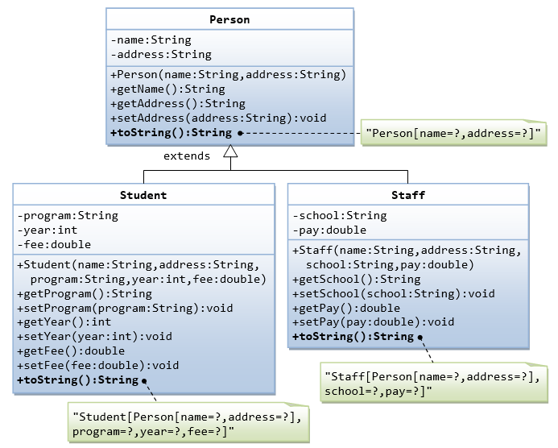
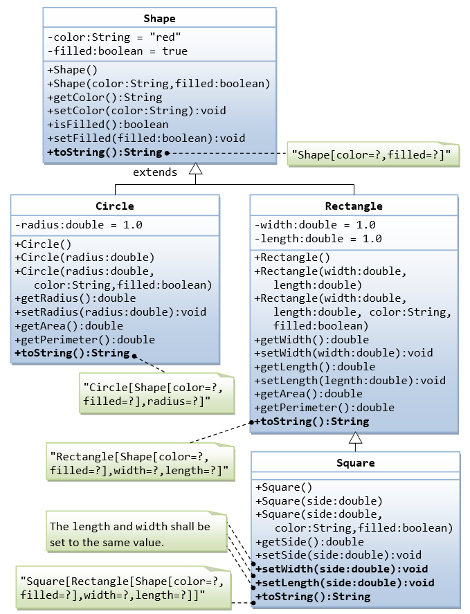
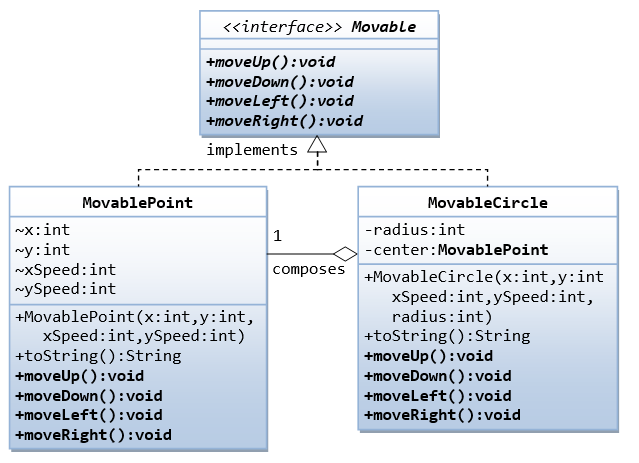
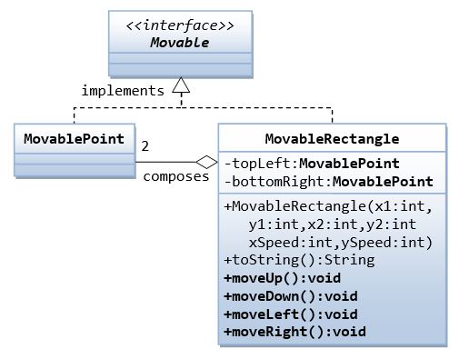

# SAPIENT ASDE - JUNE, 2021

### Recordings:

-   [Part 1](https://zoom.us/rec/share/mI1jSL38Z45-eB19oBzhQO9z4GvLM6Phh-QIpYeKZxCs8buTaIjnLszQfOJDBJYV.k77xR9y6htUeowyY 'Part 1')
-   [Part 2](https://zoom.us/rec/share/CVYAvXRaiUE8TdA6G11QjQ1UWx8-8vwPvF5pdWrRktPEn3BJ8Ad1y7zE1H7OPGks.t0cR54-_ZurI9Oin 'Part 2')

### TOC for day 3:

-   Logging - why and how
-   Code quality - sonarlint
-   OOP using Java
-   UML - different types of diagrams
-   Abtraction - classes/interfaces
-   Encapsulation - access modifiers
-   Hierarchy - aggregation/composition/inheritance/association
-   Polymorphism - interfaces over classes for loose coupling
-   SOLID principles using Java
-   Use cases and implementation

### Assignment 1

Create classes `Circle` and `Cylinder` as shown in the _UML_ diagram below:


In the `main()` function of a Program class, create an array of `Circle` references with the initialization shown below:

```java
Circle[] circles = {
	new Cylinder(12.34),
	new Cylinder(12.34, 10.0),
	new Cylinder(12.34, 10.0, "blue")
};

```

Print the area of the circular region of each cylinder along with the volume of the same.

---

### Assignment 2

Create the classes `Person`, `Student`, and `Staff` as shown in the _UML_ diagram below:



In the `main()` function of a Program class, create an array of `Person` references with the initialization shown below:

```java
Person[] people = {
	new Student("Shyam", "Bangalore, Karnataka", "Java fundamentals", 2010, 4500.0),
	new Staff("Anand", "Bangalore, Karnataka", "Delhi Public school", 35000.0),
	new Staff("Umesh", "Bangalore, Karnataka", "National Public school", 42000.0),
	new Student("Suresh", "Hassan, Karnataka", "Java fundamentals", 2012, 4750.0),
	new Student("Kiran", "Vasco, Goa", "Reactjs", 2017, 12500.0)
};

```

Print the details of all `Person` objects (using the `toString()`).

---

### Assignment 3

Create the classes `Shape`, `Circle`, `Rectangle`, and `Square` as shown in the _UML_ diagram below:



The `toString` function of the above classes should return text as given below:

| Classname | Sample return value from toString()                                                                                                          |
| --------- | -------------------------------------------------------------------------------------------------------------------------------------------- |
| Shape     | A Shape with color of xxx and filled/Not filled                                                                                              |
| Circle    | A Circle with radius=xxx, which is a subclass of yyy (where yyy is the output of the toString() method from the superclass)                  |
| Rectangle | A Rectangle with width=xxx and length=zzz, which is a subclass of yyy (where yyy is the output of the toString() method from the superclass) |
| Square    | A Square with side=xxx, which is a subclass of yyy (where yyy is the output of the toString() method from the superclass)                    |

In the `main()` method of a Program class, create an array of 10 `Shape` references containing a mixture of `Circle`, `Rectangle` and `Square` objects of different dimensions. Using a loop, print the `perimeter` and `area` for all of them.

---

### Assignment 4

Interface _Movable_ and its implementations _MovablePoint_ and _MovableCircle_

Write two concrete classes - MovablePoint and MovableCircle - that implement the Movable interface.



For the MovablePoint class, declare the instance variable x, y, xSpeed and ySpeed with package access as shown with '~' in the class diagram (i.e., classes in the same package can access these variables directly). For the MovableCircle class, use a MovablePoint to represent its center (which contains four variable x, y, xSpeed and ySpeed). In other words, the MovableCircle composes a MovablePoint, and its radius.

```java
public class MovablePoint implements Movable {
   // instance variables
   int x, y, xSpeed, ySpeed;     // package access

   // Constructor
   public MovablePoint(int x, int y, int xSpeed, int ySpeed) {
      this.x = x;
      ......
   }
   ......

   // Implement abstract methods declared in the interface Movable
   @Override
   public void moveUp() {
      y -= ySpeed;   // y-axis pointing down for 2D graphics
   }
   ......
}
```

```java
public class MovableCircle implements Movable { // saved as "MovableCircle.java"
   // instance variables
   private MovablePoint center;   // can use center.x, center.y directly
                                  //  because they are package accessible
   private int radius;

   // Constructor
   public MovableCircle(int x, int y, int xSpeed, int ySpeed, int radius) {
      // Call the MovablePoint's constructor to allocate the center instance.
      center = new MovablePoint(x, y, xSpeed, ySpeed);
      ......
   }
   ......

   // Implement abstract methods declared in the interface Movable
   @Override
   public void moveUp() {
      center.y -= center.ySpeed;
   }
   ......
}
```

Write a test program and try out these statements:

```java
Movable m1 = new MovablePoint(5, 6, 10, 15);     // upcast
System.out.println(m1);
m1.moveLeft();
System.out.println(m1);

Movable m2 = new MovableCircle(1, 2, 3, 4, 20);  // upcast
System.out.println(m2);
m2.moveRight();
System.out.println(m2);
```

Write a new class called _MovableRectangle_, which composes two _MovablePoint_ objects (representing the top-left and bottom-right corners) and implementing the _Movable_ Interface. Make sure that the two points has the same speed.



In the test program, add the following code to test the new implementation:

```java

Movable m3 = new MovableRectangle(1, 2, 3, 4, 25, 35);  // upcast
System.out.println(m3);
m3.moveUp();
System.out.println(m3);
```
