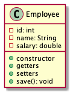
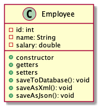
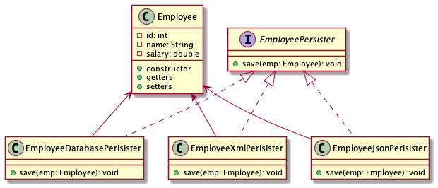
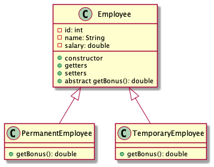
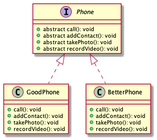
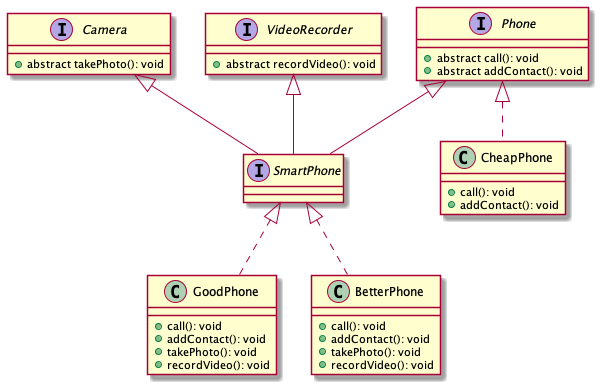

# SAPIENT ASDE - JUNE, 2021

### TOC for day 4:

-   Creating a docker image
-   SOLID principles using Java
-   Use cases and implementation
-   Design patterns overview [Java examples](https://github.com/kayartaya-vinod/2019_12_BOSCH_DESIGN_PATTERNS 'Java examples') [PDF](dp.pdf 'Design Patterns')
-   Creational patterns
-   Structural patterns
-   Behavioral patterns
-   Use cases and implementation (most useful patterns only)

### SOLID principles

-   S - Single Responsibility Principle (SRP)
-   O - Open/Closed Principle
-   L - Liskov's substitution Principle
-   I - Interface segregation Principle
-   D - Dependency inversion Principle

### Single Responsibility Principle (SRP)


-   Introduced by Robert C Martin (Uncle Bob)
-   Class should have one and only one responsibility
-   Class should have one reason to change
-   Every module or class should have responsibility over a single part of functionality provided by the software, and that responsibility should be entirely encapsulated by the class

Motivation:

-   Maintainability
-   Testability
-   Flexibility and extensibility
-   Parallel development
-   Loose coupling

Key points:

-   Each class and module should focus on a single task
-   Everything in the class should be related to that single purpose
-   There canbe many members in the class as long as they are related to the single responsibility
-   With SRP, classes become smaller and cleaner and the code is less fragile

Consider the class Employee:



But what if we need to save the Employee data to different system? Ex: Database, XML, JSON?



Solution according to SRP:



### Open/Closed Principle

-   Introduced by Robert C Martin
-   Classes should be open for extension but closed for modification
-   Any new functionality should be implemented by adding new classes, attributes and methods, instead of changing the existing ones

Implementation guidelines:

-   The simplest way to apply OCP is to implement the new funcationality on new derived classes
-   Allow clients to access the original class with abstract interface

If not followed:

-   End up testing the entire functionality
-   QA Team need to test the entire flow
-   Costly process for the organisation
-   Breaks the SRP
-   Maintenance overheads increase on the classes

OCP violation

```java
@Data
class Employee{
    private int id;
    private String name;
    private double salary;

    public double getBonus(){
        return salary * 0.15;
    }
}
```

Now, if we have two kinds of employees, permanent and temporary, and they have different calculations for bonus:

```java
@Data
class Employee{
    private int id;
    private String name;
    private double salary;
    private String type; // "permanent" or "temporary"

    public double getBonus(){
        if(type.equals("permanent")){
            return salary * 0.15;
        }
        else if(type.equals("temporary")){
            return salary * 0.10;
        }
    }
}
```

Solution to this:



```java
class Client {
    public static void main(String[] args){
        Employee emp1 = new PermanentEmployee();
        // initialize emp1
        double bonus1 = emp1.getBonus();

        Employee emp2 = new TempararyEmployee();
        // initialize emp2
        double bonus2 = emp2.getBonus();
    }
}
```

### Liskov's substitution Principle (LSP)


-   Introduced by Barbara Liskov
-   Parent classes should be easily substituted with their child classes without blowing up the application
-   Child classes should never break the parent class' type definitions.
-   Subtypes must be substitutable for their base types.

Consider:



LSP Violation:

```java
class CheapPhone implements Phone{
    public void call(){
        // ...
    }
    public void addContact(){
        // ...
    }
    public void takePhoto(){
        throw new FeatureNotAvailableException();
    }
    public void recordVideo(){
        throw new FeatureNotAvailableException();
    }
}

```

Fixing the LSP violation:



### Interface segregation Principle

-   Introduced by Robert C Martin
-   Many client specific interfaces are better than one general interface

### Dependency inversion Principle

-   Introduced by Robert C Martin
-   Classes should depend on abstraction but not on concretion
-   High-level modules should not depend on low-level modules. Both should depend on abstractions.
-   Abstractions should not depend upon details. Details should depend upon abstractions.
