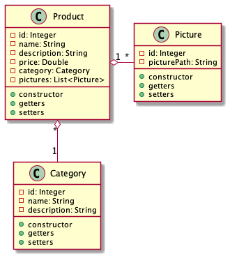
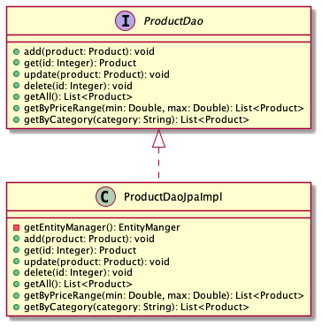
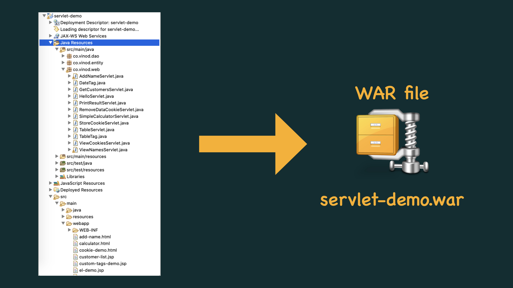
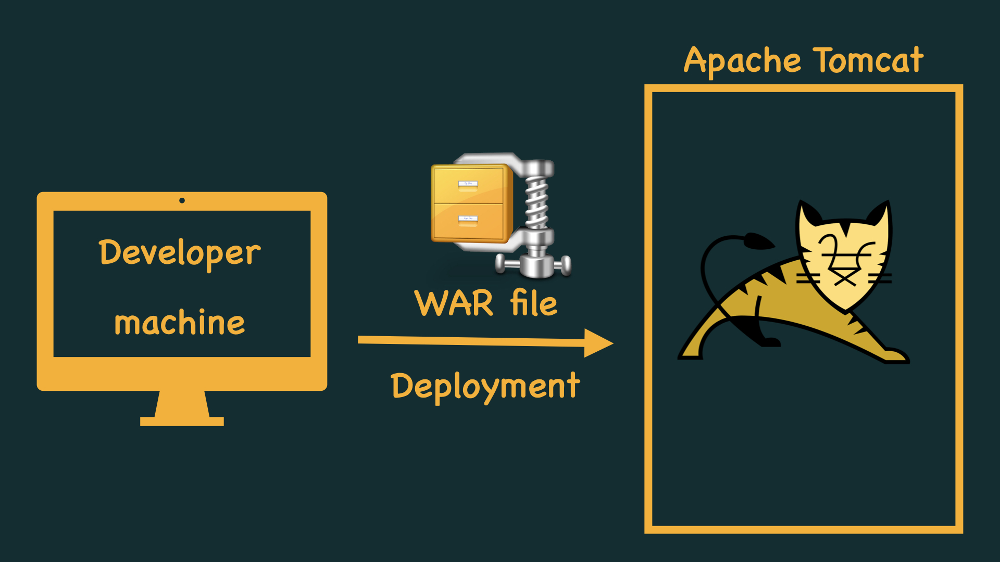
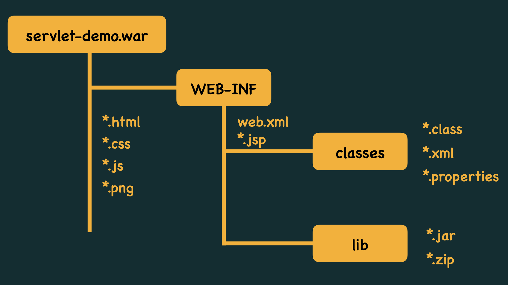
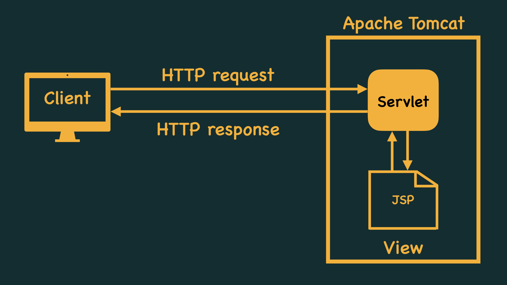

# SAPIENT ASDE - JUNE, 2021

### TOC for day 8:

-   Overview of HTTP
-   Request/Response model: RFC-2616
-   Examples: access public APIs
-   Server side coding in Java
-   Servlets and HTTP
-   Handling client requests
-   Parameters/headers/cookies

### Assignment

#### Self study - @OneToMany @ManyToOne annotations in JPA

-   Create entity classes for the following tables:
    -   category (category_id, name, description)
    -   products (product_id, name, description, price, category_id)
    -   pictures (picture_id, picture_path, product_id)

-   Create an interface called ProductDao and an implementation class called ProductDaoJpaImpl

