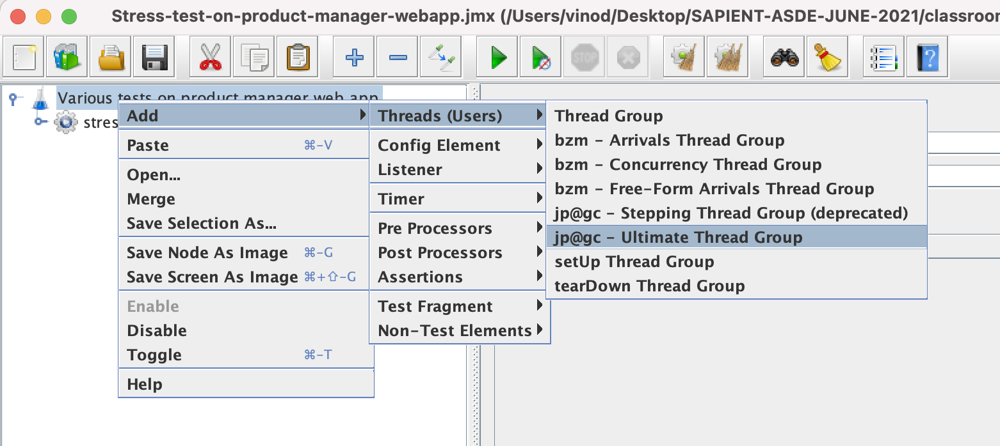
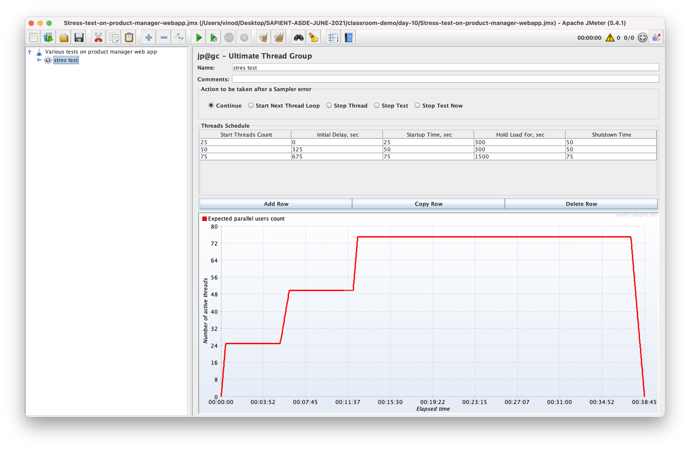

# SAPIENT ASDE - JUNE, 2021

### TOC for day 10:

-   Performance testing techniques
-   Load testing
-   Stress testing
-   Soak testing
-   Spike testing
-   Performance tools
-   Jmeter/Gatling

### References:

-   [Software testing](https://www.guru99.com/software-testing.html 'Software testing')
-   [JMeter Video tutorials](https://kelutral.com/jmeter-tutorials 'JMeter Video tutorials')

### Plugin

-   Add Ultimate Threadgroup Plugin
    -   Download the zip file for jmeter-plugins.org
    -   extract the zip file
    -   copy the content of the same into $JMETER_HOME folder
    -   restart the jmeter ui

#### How to calcuate the initial delay for increasing of load during stress test?

-   Initial time of a record = (initial time + start up time + hold time) of the previous record
-   startup time of a record = shutdown time of the previous record

## Assignment

### Now that the web application is ready,

#### Create the test plans for the following tests in jmeter and execute the same on all URLs

-   Load test
-   Stress test
-   Spike test
    -   constant spike test
    -   step-up spike test
    -   random spike test

Each test should span at least 1 hour. Capture the test results in CSV files (in your application's root folder). Also, explore executing jmeter tests from command prompt.

### Containerization

Create a docker image for the web application. Keep the `Dockerfile` in the root folder of your application.

### Continuous integration

Create a Jenkinsfile for the web application, which has the following stages:

-   Unit test
-   Build
-   Performance test
-   Containerization
